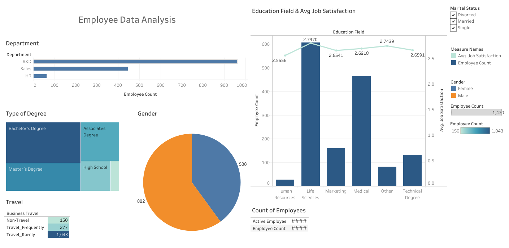

# 📊 Employee Data Analysis Dashboard

## 📌 Overview

This project presents an interactive **Employee Data Analysis Dashboard** that provides insights into workforce distribution, education background, job satisfaction, and travel patterns. The dashboard helps stakeholders make data-driven HR decisions.

---

## 🎯 Key Features

* 📈 **Department Analysis** – Visualizes employee distribution across departments (R&D, Sales, HR)
* 🎓 **Education Insights** – Shows employee count and average job satisfaction by education field
* 🧑‍🤝‍🧑 **Gender Distribution** – Pie chart representing gender balance
* 🎓 **Degree Breakdown** – Tree map of employee qualifications
* ✈️ **Travel Analysis** – Employee travel frequency insights
* 📊 **Interactive Filters** – Filter data by marital status and other attributes

---

## 🖼️ Dashboard Preview



---

## 🛠️ Tech Stack

* **Data Visualization Tool:** Tableau / Power BI *(update based on your tool)*
* **Data Processing:** Python / Excel *(if applicable)*
* **Version Control:** Git & GitHub

---

## 📂 Project Structure

```
├── data/
│   └── employee_data.csv
├── dashboard/
│   └── employee_dashboard.pbix / .twbx
├── images/
│   └── dashboard.png
├── README.md

## 📊 Insights Derived

* R&D department has the highest number of employees.
* Employees with Life Sciences and Medical backgrounds dominate the workforce.
* Average job satisfaction varies slightly across education fields.
* Majority of employees travel rarely.
* Gender distribution shows a higher proportion of male employees.


⭐ If you found this project helpful, please give it a star!
